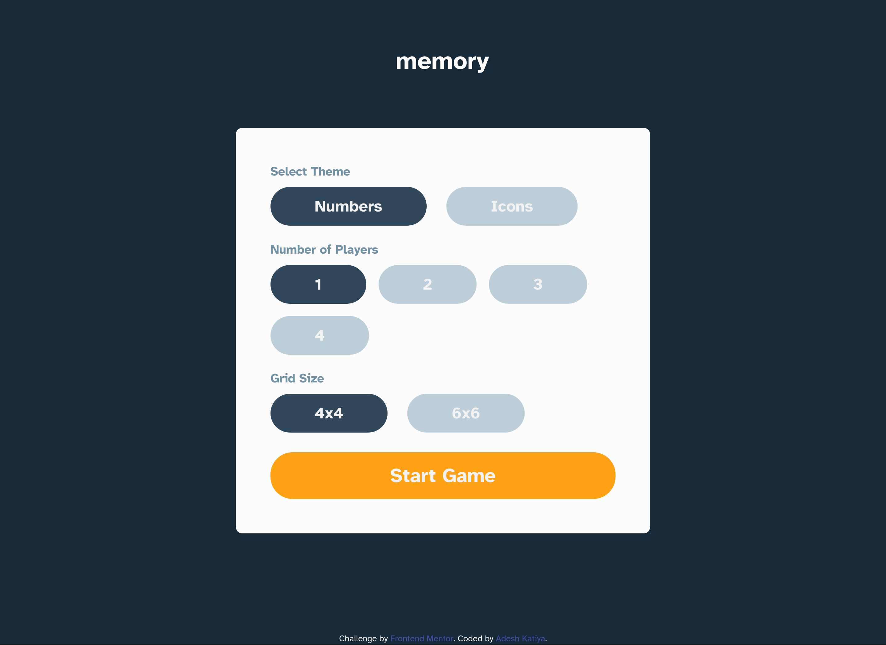

# Frontend Mentor - Memory Game solution

This is a solution to the [Memory Game challenge on Frontend Mentor](https://www.frontendmentor.io/challenges/memory-game-vse4WFPvM). Frontend Mentor challenges help you improve your coding skills by building realistic projects.

## Table of contents

- [Frontend Mentor - Memory Game solution](#frontend-mentor---memory-game-solution)
  - [Table of contents](#table-of-contents)
  - [Overview](#overview)
    - [The challenge](#the-challenge)
    - [Screenshot](#screenshot)
    - [Links](#links)
  - [My process](#my-process)
    - [Built with](#built-with)
    - [What I learned](#what-i-learned)
    - [Continued development](#continued-development)
    - [Useful resources](#useful-resources)

## Overview

### The challenge

Users should be able to:

- Play the Memory game either solo or multiplayer (up to 4 players)
- Set the theme to use numbers or icons within the tiles
- Choose to play on either a 6x6 or 4x4 grid
- View the optimal layout for the game depending on their device's screen size
- See hover states for all interactive elements on the page

### Screenshot

### Links

- Live Site URL: [Memory Game](https://fem-memory-game.vercel.app/)

## My process

### Built with

- Semantic HTML5 markup
- CSS custom properties
- Flexbox
- CSS Grid
- Mobile-first workflow
- [React](https://reactjs.org/) - JS library
- [Tailwind CSS](https://tailwindcss.com/) - For Styles
- [Vite](https://vite.dev/) - Build Tool
- [Font Awesome](https://fontawesome.com/) - For Icons

### What I learned

- Learned how to architecture a big app with a lot of files and components.
- How to manage a centralized state and functionality throughout the app.
- How to centralize constants and reuse them throughout the app.
- How to use Font Awesome svg icons in a react app.
- How to derive dynamic classes based on conditionals, props, boolean states.
- How to reuse components throughout the app.
- Using reducer/actions to manage multiple states.
- Saving and Updating/Loading state saved in localStorage.
- Responsive behavior on different screen sizes.

### Continued development

- Probably be using Next.js to create this project fast.
- Use a popular state management library here (Redux).

### Useful resources

- [Font Awesome usage with React ](https://docs.fontawesome.com/web/use-with/react) - Docs showing how to setup react to use font awesome icons.
- [React docs for using reducer](https://react.dev/learn/extracting-state-logic-into-a-reducer) - docs in react using reducer to manage states
